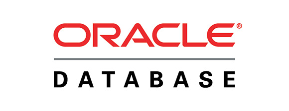
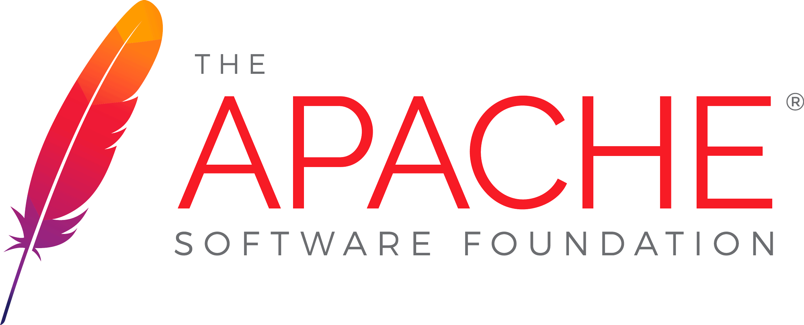

  [![MIT License][license-shield]][license-url]
  [![LinkedIn][linkedin-shield]][linkedin-url]

 

  

  <h3 align="center">Oracle PHP Stack Template</h3>

  

    Un template de docker para iniciar rápidamente proyectos web que tengan que conectarse a Oracle con la librería OCI
     
    <a href="https://github.com/ricurdinola/docker-php-oracle"><strong>Explorar el repo »</strong></a>
     
     
    <a href="https://github.com/ricurdinola/docker-php-oracle/issues">Reportar un Bug </a>
    ·
    <a href="https://github.com/ricurdinola/docker-php-oracle/issues">Sugerencias </a>
  

## Sobre el Proyecto
El proyecto tiene como objetivo instalar rápidamente un ambiente de desarrollo local para trabajar
con [PHP](https://www.php.net/) y [Oracle Database](https://www.oracle.com/ar/database/)
utilizando [Docker](https://www.docker.com) como gestor de contenedores.

El proyecto se encuentra configurado como template, por lo que fácilmente se puede crear un repositorio
propio a partir de este proyecto.

Como tiene un objetivo general, cuenta con configuraciones básicas de PHP y Apache, teniendo que 
ser adaptado a los requerimientos específicos de cada proyecto. 

<a href="#top">Ir al Inicio</a>

### Descripción del Stack

    
    
    
    

El stack se compone de los siguientes elementos:

* Un servidor web Apache con PHP 8. Por defecto, se utiliza la imagen oficial de PHP: php:8.1-apache
* Se incorporó Node en su versión 14.16.0
* La gestión de dependencias mediante composer se encuentra integrada al servidor web por lo que no es necesaria su instalación en el entorno local.

<a href="#top">Ir al Inicio</a>

## Utilizando el Stack
A continuación, se describe brevemente la utilización del proyecto.

### Pre-requisitos
Solo es necesario tener instalado el [Docker](https://www.docker.com/products/docker-desktop) y el [Docker Compose](https://docs.docker.com/compose/install/)

### Estructura de Archivos
* `/web-server` Contiene el _Dockerfile_ del servidor web. Si necesitas instalar una extensión del 
php o incorporar una librería, vas a tener que modificar el archivo de esta carpeta. Hay un dockerfile-dist para tomar de ejemplo en donde se copia el contenido de la carpeta www en lugar de montarla.
* `/web-server/config` Contiene los directorios de configuración de Apache y PHP. Los archivos de 
configuración de esta carpeta se copian al contenedor al momento de generarlos. Si se modifican, será necesario
  regenerar los contenedores.
* `/web-server/www/` Es la carpeta para los archivos Web. Por defecto viene un PHP Info.

### Configurar el ambiente de desarrollo
En el directorio raíz, existe un archivo .env, el cual contiene los siguientes parámetros configurados.

#### Stack Options
* `COMPOSE_PROJECT_NAME`: Es el nombre del stack de contenedores que se generarán.

#### PHP-Apache Options
* `WEB_WERVER_NAME`: El nombre que le daremos al contenedor del servidor Web.
* `PHP_PORT`: El puerto por medio del cual se accederá al contenedor web.
* `PHP_VERSION`: Versión de PHP que se va a utilizar. Por defecto, se utiliza la versión 8.1. Se pueden
ver más [versiones disponibles](https://github.com/docker-library/docs/blob/master/php/README.md#supported-tags-and-respective-dockerfile-links)

### Instalar el ambiente de desarrollo
Una vez cambiado los parámetros deseados, se debe ejecutar el archivo `build.sh`

<a href="#top">Ir al Inicio</a>

## Licencia
Distribuido bajo Licencia MIT. Para más información, ver el archivo
[LICENSE](https://github.com/ricurdinola/docker-php-oracle/blob/main/LICENSE)

<a href="#top">Ir al Inicio</a>

## Contacto
Ricardo Urdinola - ricurdinola@gmail.com - [Mis Repositorios](https://github.com/ricurdinola?tab=repositories)

<a href="#top">Ir al Inicio</a>

## Agradecimientos
El conocimiento y las herramientas se contruyen sobre la base y el trabajo de la comunidad.
Es por eso que agradecemos a los colaboradores que mantienen los siguientes recursos.

* [Best Readme Template](https://github.com/othneildrew/Best-README-Template)
* [Img Shields](https://shields.io)
* [Docker](https://www.docker.com/)
* [Composer](https://getcomposer.org/)
* [Node.js](https://nodejs.org/)
* [Apache](https://httpd.apache.org/)
* [PHP](https://www.php.net/)

<a href="#top">Ir al Inicio</a>

[license-shield]: https://img.shields.io/github/license/ricurdinola/docker-lamp-stack?style=for-the-badge

[license-url]: https://github.com/ricurdinola/docker-php-oracle/blob/main/LICENSE

[linkedin-shield]: https://img.shields.io/badge/-LinkedIn-black.svg?style=for-the-badge&logo=linkedin&colorB=555

[linkedin-url]: https://www.linkedin.com/in/urdinolaricardo/